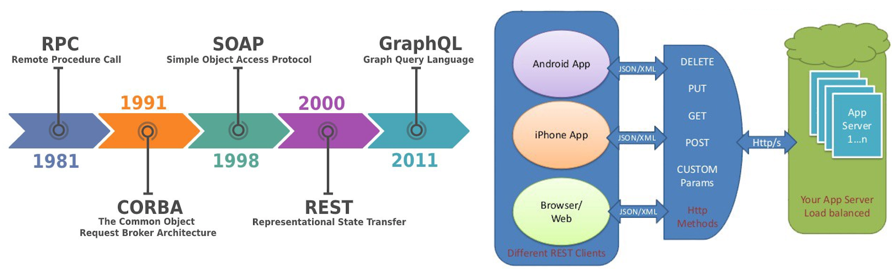
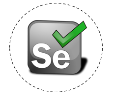

# Comprehensive Data Acquisition Course 

Welcome to the Data Acquisition Repository Managed by Muhammad Sheraz.This repository has been meticulously crafted to serve as an advanced and comprehensive guide for mastering the intricacies of data acquisition. Every resource within this repository has been created with utmost care to provide you with a profound understanding of data collection techniques.I have developed all the resources available here. My goal is to empower you with the knowledge and skills needed to navigate complex scenarios and excel in various applications.

  
  

# Lecture 1: Getting Yourself Unstuck

- **Introduction**
- **Being a Data Scientist Means Knowing How to Get Yourself Unstuck**
- **The Places to Go For Help, In Order**

### Methods for Getting Unstuck

- **Method 1: Reading and Understanding Python Errors**
- **Method 2: Using the Built-in Python Documentation**
   - Using a Console Window in JupyterLab
   - How to Call Up and Read a Docstring
-. **Method 3: Using Google and Other Search Engines**
   - How to Avoid Toxicity in Online Communities
- **Method 4: Stack Overflow**
   - How Stack Overflow Works
   - Asking a Question on Stack Overflow
- **Method 5: Using a Large-Language Model (a ChatBot) to Generate and Debug Code**
   - How to Access a ChatBot for Coding
   - Prompt Engineering for Generating New Code
   - Example: Data from the World Bank
   - Prompt Engineering for Debugging or Explaining Existing Code
- **Method 6: Interacting with the Global Community of Python Users**
   - Python Slack and Discord
   - Live Chats With Python Users on Freenode
   - Python Mailing Lists and Newsgroups

## Lecture 2: Loading and Working with Electronic Data Files

- **Loading Data from Electronic Data Files**
  - Introduction: Please don’t bend, fold, spindle, or mutilate me
  - Changing the Working Directory
  - Text-Based Data Files
  - Looking at the DataFrame to See if it Loaded Correctly
  - Viewing the Data as a Spreadsheet
  - Displaying the Data Type of Each Column
  - Displaying Column Names
  - Descriptive Statistics

- **Identifying and Solving Problems with Text-Based Data Files**
  - Comments Prior to the Header
  - Data with Numeric Missing Codes
  - Comments Inside the Data
  - Data Without Column Names
  - Delimiters Other Than Commas
  - Fixed-width Files

- **Loading Other Kinds of Electronic Data Files**
  - Loading Excel Files
  - Loading SAS, Stata, and SPSS Files

- **Saving CSV and ASCII Files to Disk**
  - Saving CSV and ASCII Files to Disk

## Lecture 3: Loading, Converting, and Writing JSON Files

- **The Structure of a JSON File**
  - Introduction: Douglas Crockford’s JSON Saga
  - Lists, Sets, and Dictionaries
  - Nested Structures
  - Metadata
  - Missing Values and Different Data Types

- **Loading and Reading JSON Data in Python**
  - Using the `requests.get()`, `json.loads()`, and `json.dumps()` Functions
  - Searching Along the JSON Index Path
  - Looping Across Records to Extract Datapoints
  - Using `pd.read_json()` and `pd.json_normalize()` to Store JSON Data in a Data Frame

- **Situations with JSON Data**
  - Situation 1: No nesting, no metadata
  - Situation 2: Nesting, but no metadata
  - Situation 3: Metadata

- **Saving JSON Files and Converting Data Frames to JSON**
  - Saving Existing JSON Files to Disk
  - Converting Tabular DataFrames to JSON

## Lecture 4: Acquiring Data from APIs

- **What is an API?**
- **Introduction: Understanding APIs for Data Transfer**
- **Making API Requests in Python**
- **Example: Weather API**
- **API Status Codes**
- **API Documentation**
- **Reading API Documentation (Example: the NASA Image and Video Library)**
- **Reasons to Use API**

## Lecture 5: Overview-of-Web-Scraping

- **What is Web Scraping?**
- **How Web Scraping Works?**
- **Scrapy VS BeautifulSoup VS  Selenium**
- **Is Web Scraping Legal?**
- **Overview of a Web Application Architecture**  
- **The Anatomy of a Web Page**
- **The Document Object Model**
- **Fetching Web Page Contents**
  - **using Python `urllib` Package**
  - **using Python `Requests` Package**
- **Example 1: Fetching, Reading and saving the HTML code of a Web page in a Text File**
- **Example 2: Fetching, Reading and saving an Image from the Web Page in a Binary File**
  
## Lecture 6: Web Scraping with BeautifulSoup

- **Overview of BeautifulSoup**
  - What is BeautifulSoup and how it works?
  - Download and Install BeautifulSoup

- **Playing with BeautifulSoup**
  - Reviewing the Books Scraping Website
  - Fetching HTML Contents Using `requests` Library
  - Creating the Soup Object using `BeautifulSoup` Library
  - Accessing Attributes of `Soup` Object
  - Using the `soup.find()` Method
  - Using the `soup.find_all()` Method
  - Iterating Through the List returned by `soup.find_all()` Method

- **Example 1: Scraping Information from a Single Web Page**
  - Extracting Book Titles/Authors
  - Extracting Book Prices
  - Extracting Book Availability (In-Stock)
  - Extracting Book Review Count
  - Extracting Book Star Ratings
  - Extracting Book Links
  - Saving data into CSV file on disk

- **Example 1 (cont): Scraping Information from Multiple Web Pages**
  - Extracting Book Titles/Authors, Prices, Availability, Review Count, Star Ratings, and Links from multiple pages
  - Saving data into CSV file on disk

- **Example 2: Scraping Information from Multiple Web Pages (Pagination)**
  - Extracting required information
  - The Concept of Pagination
  - How to extract information from Multiple Web Pages using Pagination?
  - Saving data into CSV file on disk

- **Limitations of BeautifulSoup**

- **Some Coding Exercises**

## Lecture 7: Selenium for Web Scraping and Automation

- **Overview of Selenium (Why, What and How)**
  - Why use Selenium?
  - What is Selenium? (Selenium Architecture)
  - How to use Selenium?
  - Download and Install Selenium
  - Download Selenium WebDriver for your browser (Chrome, Safari, Firefox, Internet Explorer)
  - Setting options of Chrome Driver (Headless mode)

- **A Step-by-Step Hello World with Selenium**
  - Create an instance of Browser
  - Load a Web page in the browser window
  - Access browser information
  - Perform Different operations on the browser
  - Create a new tab in the browser window and shift between tabs
  - Close browser tab or close the entire session

- **Example 1: Scraping a JavaScript Driven WebSite (https://arifpucit.github.io/bss2/js/)**
  - What is JavaScript Driven Website?
  - What happens when we use Requests and BeautifulSoup to scrape JS websites?
  - Using Selenium and BeautifulSoup to scrape JS websites

- **Example 2: Scraping Dynamic WebSites (https://arifpucit.github.io/bss2/login/)**
  - Different Ways to Locate Web elements using Selenium
  - Selenium `find_element()` and `find_elements()` methods
  - Selenium Locators
    - ID
    - NAME
    - TAG_NAME
    - CLASS_NAME
    - LINK_TEXT
    - PARTIAL_LINK_TEXT
    - CSS_SELECTOR
    - XPATH
  - Entering text in a Text Box on a Web Page
  - Clicking a Button element on a web page
  - Consolidated Script to Login and Scrape Books Data

- **Example 3: Scraping Web Pages that Employ Infinite Scrolling**

- **Example 4: Scraping Web Pages that Employ Pagination:**

- **Example 5: Scraping Web Pages that use Pop-ups:**

- **Bonus:**
  - Email Scraped CSV file from Python

---

## How to Use

To harness the full power of this resource:

1. Clone this repository to your local machine using `git clone`.
2. Explore the relevant data structure or algorithm folder that interests you.
3. Review the provided code examples.
4. Run the Python code examples to see how the concepts work in practice.
5. Complete the exercises to gain hands-on experience and reinforce your understanding.
6. Utilize the content as a reference, study guide, or teaching material for coding interviews, technical challenges, or personal projects.
7. Contribute, report issues, or suggest improvements to elevate the quality of this repository further.

## Get in Touch

If you have questions, suggestions, or feedback, feel free to create an issue or reach out to me via email at [sheraz601050@gmail.com](mailto:sheraz601050@gmail.com).
---

## Happy Learning! 🚀

I hope you find this repository helpful in your journey to mastering data structures and algorithms. Keep learning, practicing, and happy coding! 😄

This repository  has been meticulously crafted to provide you with an elite understanding of data acquisition. Use it wisely, and go conquer the world of technology!

## Repository Overview:

- **Creator:** Muhammad Sheraz
- **Purpose:** This repository is dedicated to offering a comprehensive exploration of data acquisition, covering essential concepts and practical techniques.It aims to equip you with the knowledge and skills needed to thrive in the ever-evolving landscape of data-related challenges.

Happy learning!

**Muhammad Sheraz**

