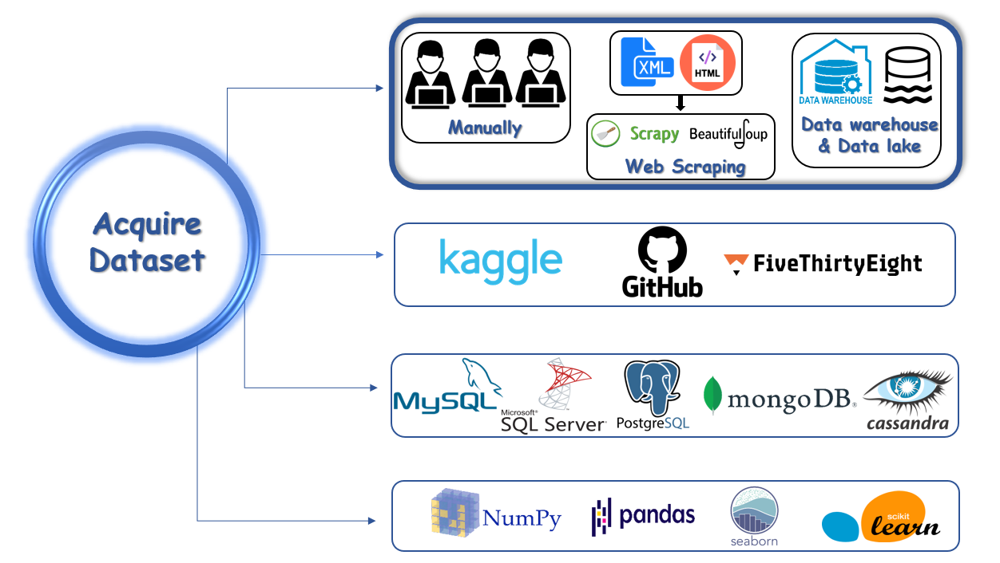
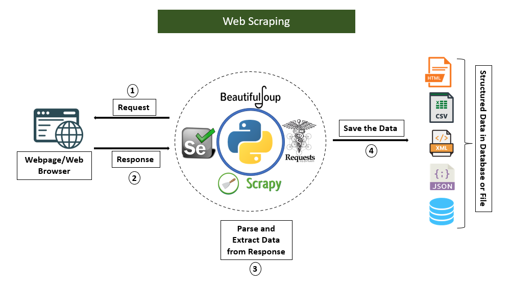

# Comprehensive Data Acquisition Course 

  

    
Welcome to the Comprehensive Data Acquisition Course Repository by Muhammad Sheraz. This repository is meticulously crafted to provide an extensive and advanced resource for mastering the intricacies of data acquisition. Our goal is to empower you with a profound understanding of data collection techniques, enabling you to navigate complex scenarios and excel in various applications.

  

  

## Lecture 1: Getting Yourself Unstuck

- **Introduction**
- **Being a Data Scientist Means Knowing How to Get Yourself Unstuck**
- **The Places to Go For Help, In Order**

### Methods for Getting Unstuck

1. **Method 1: Reading and Understanding Python Errors**
2. **Method 2: Using the Built-in Python Documentation**
   - Using a Console Window in JupyterLab
   - How to Call Up and Read a Docstring
3. **Method 3: Using Google and Other Search Engines**
   - How to Avoid Toxicity in Online Communities
4. **Method 4: Stack Overflow**
   - How Stack Overflow Works
   - Asking a Question on Stack Overflow
5. **Method 5: Using a Large-Language Model (a ChatBot) to Generate and Debug Code**
   - How to Access a ChatBot for Coding
   - Prompt Engineering for Generating New Code
   - Example: Data from the World Bank
   - Prompt Engineering for Debugging or Explaining Existing Code
6. **Method 6: Interacting with the Global Community of Python Users**
   - Python Slack and Discord
   - Live Chats With Python Users on Freenode
   - Python Mailing Lists and Newsgroups

## Lecture 2: Loading and Working with Electronic Data Files

- **Loading Data from Electronic Data Files**
  - Introduction: Please don’t bend, fold, spindle, or mutilate me
  - Changing the Working Directory
  - Text-Based Data Files
  - Looking at the DataFrame to See if it Loaded Correctly
  - Viewing the Data as a Spreadsheet
  - Displaying the Data Type of Each Column
  - Displaying Column Names
  - Descriptive Statistics

- **Identifying and Solving Problems with Text-Based Data Files**
  - Comments Prior to the Header
  - Data with Numeric Missing Codes
  - Comments Inside the Data
  - Data Without Column Names
  - Delimiters Other Than Commas
  - Fixed-width Files

- **Loading Other Kinds of Electronic Data Files**
  - Loading Excel Files
  - Loading SAS, Stata, and SPSS Files

- **Saving CSV and ASCII Files to Disk**
  - Saving CSV and ASCII Files to Disk

## Lecture 3: Loading, Converting, and Writing JSON Files

### The Structure of a JSON File

- **Introduction: Douglas Crockford’s JSON Saga**
- **Lists, Sets, and Dictionaries**
- **Nested Structures**
- **Metadata**
- **Missing Values and Different Data Types**

### Loading and Reading JSON Data in Python

- **Using the `requests.get()`, `json.loads()`, and `json.dumps()` Functions**
- **Searching Along the JSON Index Path**
- **Looping Across Records to Extract Datapoints**
- **Using `pd.read_json()` and `pd.json_normalize()` to Store JSON Data in a Data Frame**

### Situations with JSON Data

- **Situation 1: No nesting, no metadata**
- **Situation 2: Nesting, but no metadata**
- **Situation 3: Metadata**

### Saving JSON Files and Converting Data Frames to JSON

- **Saving Existing JSON Files to Disk**
- **Converting Tabular DataFrames to JSON**

---

## How to Use

To harness the full power of this resource:

1. Clone this repository to your local machine using `git clone`.
2. Explore the relevant data structure or algorithm folder that interests you.
3. Review the provided code examples.
4. Run the Python code examples to see how the concepts work in practice.
5. Complete the exercises to gain hands-on experience and reinforce your understanding.
6. Utilize the content as a reference, study guide, or teaching material for coding interviews, technical challenges, or personal projects.
7. Contribute, report issues, or suggest improvements to elevate the quality of this repository further.

## Get in Touch

If you have questions, suggestions, or feedback, feel free to create an issue or reach out to me via email at [sheraz601050@gmail.com](mailto:sheraz601050@gmail.com).
---

## Happy Learning! 🚀

I hope you find this repository helpful in your journey to mastering data structures and algorithms. Keep learning, practicing, and happy coding! 😄

This repository  has been meticulously crafted to provide you with an elite understanding of data acquisition. Use it wisely, and go conquer the world of technology!

## Repository Overview:

- **Creator:** Muhammad Sheraz
- **Purpose:** This repository is dedicated to offering a comprehensive exploration of data acquisition, covering essential concepts and practical techniques.It aims to equip you with the knowledge and skills needed to thrive in the ever-evolving landscape of data-related challenges.

Happy learning!

**Muhammad Sheraz**

